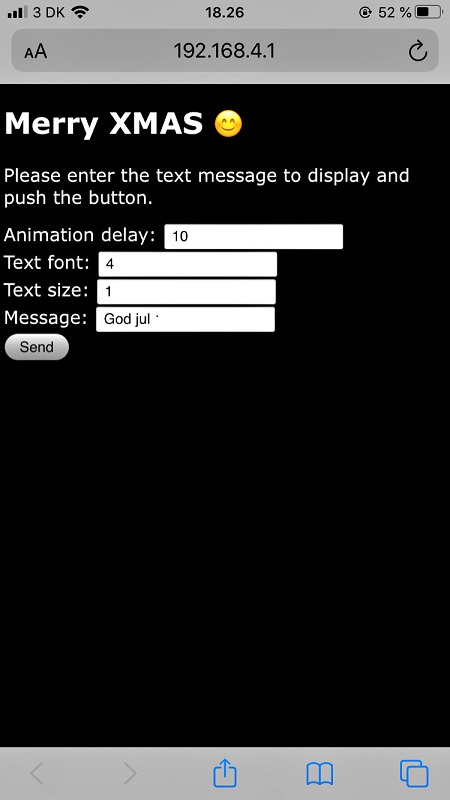

# XMAS
Christmas 2019 demo for ESP32 microcontroller on the LilyGO TTGO T-Display board. Displays a flashing Christmas tree and a static greeting text.
Also provides a WiFi hotspot for customizing the animation and the text.

 

Read more about the T-Display board here:

http://www.lilygo.cn/claprod_view.aspx?TypeId=21&Id=1128

https://github.com/Xinyuan-LilyGO/TTGO-T-Display
